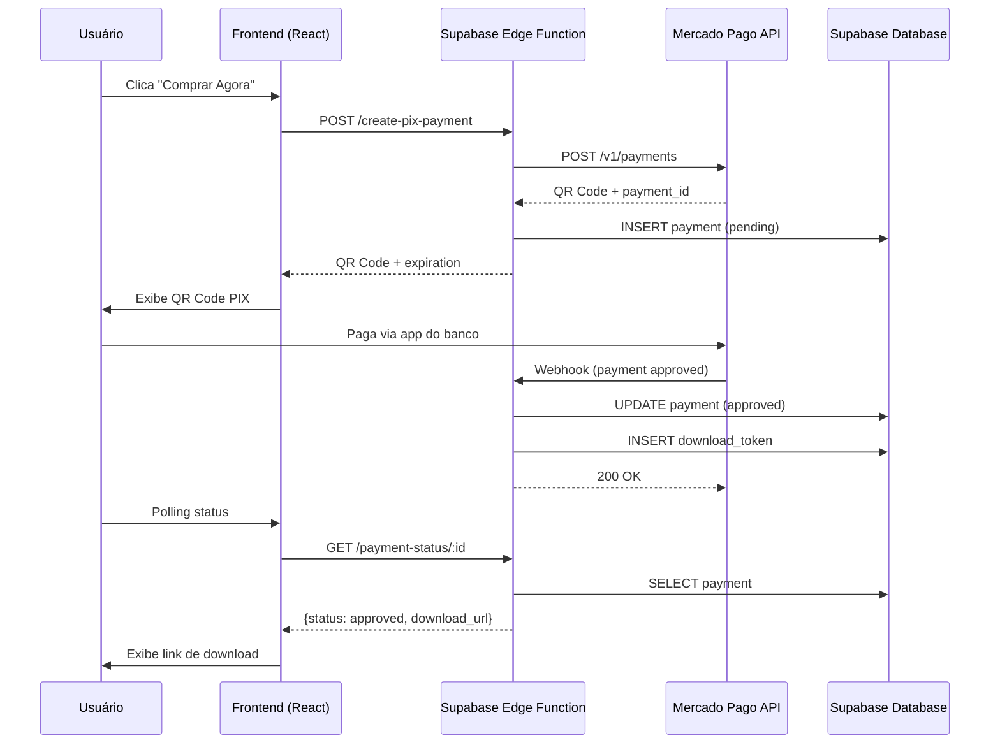

# 🚀 Antigravity Config Store - Plano de Implementação

> **Status**: ✅ Aprovado  
> **Criado em**: 20 de Dezembro de 2025  
> **Última atualização**: 20 de Dezembro de 2025

Landing page para venda de configurações Antigravity/Gemini CLI com pagamento PIX via Mercado Pago.

---

## 📋 Ordem de Implementação

| # | Fase | Status | Descrição |
|---|------|--------|-----------|
| 1 | **Frontend** | 🔲 Pendente | Landing page React brutalista |
| 2 | **Backend** | 🔲 Pendente | Supabase (projeto novo) + Edge Functions |
| 3 | **Pagamento** | 🔲 Pendente | Integração Mercado Pago PIX |
| 4 | **Conteúdo** | 🔲 Pendente | GEMINI.md + Comandos + Guia PDF |
| 5 | **Testes** | 🔲 Pendente | Fluxo completo e verificação |

---

## 🏗️ Arquitetura



---

## 📦 Fase 1: Frontend (Landing Page)

### Arquivos a criar

| Arquivo | Descrição |
|---------|-----------|
| `src/pages/AntigravityPage.tsx` | Página principal da landing |
| `src/components/antigravity/HeroSection.tsx` | Hero com headline e CTA |
| `src/components/antigravity/ComparisonSection.tsx` | "Antes vs Depois" |
| `src/components/antigravity/FeaturesSection.tsx` | O que vem no pacote |
| `src/components/antigravity/PricingCard.tsx` | Card de preço único |
| `src/components/antigravity/FAQSection.tsx` | Perguntas frequentes |
| `src/components/antigravity/CheckoutModal.tsx` | Modal de checkout PIX |

### Modificações

- **`src/App.tsx`**: Adicionar rota `/antigravity`

### Design Brutalista

```css
/* Tokens a usar */
--border: 4px solid;
--radius: 0rem;
--shadow: 4px 4px 0px;
--font-family: 'Space Mono', monospace;
```

- Cards: `border-4 border-black shadow-brutal`
- Botões: `hover:translate-x-1 hover:translate-y-1`
- Cores: Preto, branco, acentos vibrantes (amarelo/verde)

---

## 🗄️ Fase 2: Backend (Supabase)

### Criar Projeto Supabase

1. Novo projeto no Supabase Dashboard
2. Região: `sa-east-1` (São Paulo)
3. Configurar variáveis de ambiente

### Tabela: `payments`

```sql
CREATE TABLE payments (
  id UUID PRIMARY KEY DEFAULT gen_random_uuid(),
  external_reference TEXT UNIQUE NOT NULL,
  mercadopago_payment_id TEXT,
  email TEXT NOT NULL,
  amount DECIMAL(10,2) NOT NULL,
  status TEXT DEFAULT 'pending',
  download_token UUID,
  download_used_at TIMESTAMPTZ,
  created_at TIMESTAMPTZ DEFAULT now(),
  updated_at TIMESTAMPTZ DEFAULT now()
);

CREATE INDEX idx_payments_external_reference ON payments(external_reference);
CREATE INDEX idx_payments_download_token ON payments(download_token);
```

### Edge Functions

| Função | Endpoint | Descrição |
|--------|----------|-----------|
| `create-pix-payment` | POST | Cria pagamento PIX |
| `mercadopago-webhook` | POST | Recebe notificações |
| `payment-status` | GET | Consulta status |
| `download` | GET | Serve arquivo ZIP |

---

## 💳 Fase 3: Pagamento (Mercado Pago)

### Credenciais Necessárias

- `ACCESS_TOKEN` (sandbox e produção)
- `PUBLIC_KEY`

### Fluxo PIX

1. Frontend envia e-mail do comprador
2. Backend cria pagamento via `/v1/payments`
3. Retorna QR Code + código copia-e-cola
4. Frontend faz polling até status = `approved`
5. Webhook atualiza banco e gera token de download

### Validação de Webhook

- Verificar header `x-signature`
- Validar `external_reference`

---

## 📚 Fase 4: Conteúdo do Produto

### Arquivos do Pacote

| Arquivo | Descrição |
|---------|-----------|
| `GEMINI.md` | Versão otimizada (~80 linhas) |
| `GEMINI-verbose.md` | Versão com explicações completas |
| `commands/create-feature.toml` | Criação de feature com worktree |
| `commands/investigate.toml` | Descoberta sistemática |
| `commands/investigate-batch.toml` | Descoberta econômica |
| `commands/open-pr.toml` | Abertura de PR com diagramas |
| `commands/review-staged.toml` | Review de código staged |
| `commands/trim.toml` | Redução de PR descriptions |
| `commands/audit.toml` | Auditoria de segurança |
| `guia-antigravity.pdf` | Guia completo de configuração |

---

## 💰 Pricing

| Item | Valor |
|------|-------|
| Antigravity Config Pack | **R$ 47,00** |

- Pagamento único via PIX
- Download instantâneo
- Garantia de 7 dias

---

## 🔧 Environment Variables

```bash
# Supabase Edge Functions
MERCADOPAGO_ACCESS_TOKEN=your_access_token
MERCADOPAGO_PUBLIC_KEY=your_public_key
PRODUCT_PRICE=47.00

# Frontend (.env.local)
VITE_SUPABASE_URL=https://your-project.supabase.co
VITE_SUPABASE_ANON_KEY=your_anon_key
```

---

## ✅ Checklist de Verificação

### Testes Automatizados

```bash
# Testar Edge Functions localmente
supabase functions serve --env-file .env.local

# Testar criação de pagamento (sandbox)
curl -X POST http://localhost:54321/functions/v1/create-pix-payment \
  -H "Content-Type: application/json" \
  -d '{"email": "test@test.com"}'
```

### Testes Manuais

- [ ] Fluxo completo de pagamento (sandbox)
- [ ] Geração e expiração de links
- [ ] Webhooks
- [ ] Responsividade (mobile/tablet/desktop)
- [ ] Download do ZIP

---

## 📊 Timeline Estimada

| Fase | Duração |
|------|---------|
| Frontend (Landing Page) | ~4h |
| Backend (Supabase Setup) | ~3h |
| Pagamento (Mercado Pago) | ~2h |
| Conteúdo (GEMINI + Comandos) | ~2h |
| Guia PDF | ~2h |
| Testes e Ajustes | ~2h |
| **Total** | **~15h** |
