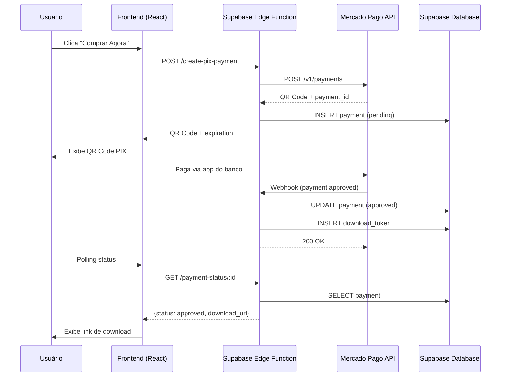

# 🚀 Antigravity Config Store - Plano de Implementação

> **Status**: ✅ Implementado  
> **Criado em**: 20 de Dezembro de 2025  
> **Última atualização**: 23 de Dezembro de 2025

Landing page para venda de configurações Antigravity/Gemini CLI com pagamento PIX via Mercado Pago.

---

## 📋 Status de Implementação

| # | Fase | Status | Descrição |
|---|------|--------|-----------|
| 1 | **Frontend** | ✅ Completo | Landing page React brutalista |
| 2 | **Backend** | ✅ Completo | Supabase + Edge Functions |
| 3 | **Pagamento** | ✅ Completo | Mercado Pago PIX (Produção) |
| 4 | **Conteúdo** | ✅ Completo | GEMINI.md + Comandos |
| 5 | **Segurança** | ✅ Completo | Auditoria + CORS + RLS |

---

## 🏗️ Arquitetura Implementada



---

## 📦 Fase 1: Frontend (Landing Page) ✅

### Componentes Implementados

| Arquivo | Descrição |
|---------|-----------|
| `src/pages/AntigravityPage.tsx` | Página principal com SEO |
| `src/components/antigravity/HeroSection.tsx` | Hero com headline e CTA |
| `src/components/antigravity/ComparisonSection.tsx` | "Antes vs Depois" |
| `src/components/antigravity/FeaturesSection.tsx` | O que vem no pacote |
| `src/components/antigravity/PricingSection.tsx` | Card de preço único |
| `src/components/antigravity/FAQSection.tsx` | Perguntas frequentes |
| `src/components/antigravity/CheckoutModal.tsx` | Modal de checkout PIX |

### Design Brutalista

```css
--border: 4px solid;
--radius: 0rem;
--shadow: 4px 4px 0px;
--font-family: 'Space Mono', monospace;
```

---

## 🗄️ Fase 2: Backend (Supabase) ✅

### Projeto Supabase

- **Project ID**: `fhssyflsioligyecqlts`
- **Região**: São Paulo (sa-east-1)
- **Dashboard**: [Link](https://supabase.com/dashboard/project/fhssyflsioligyecqlts)

### Tabela: `payments`

```sql
CREATE TABLE payments (
  id UUID PRIMARY KEY DEFAULT gen_random_uuid(),
  external_reference TEXT UNIQUE NOT NULL,
  mercadopago_payment_id TEXT,
  email TEXT NOT NULL,
  amount DECIMAL(10,2) NOT NULL,
  status TEXT DEFAULT 'pending',
  download_token UUID,
  download_used_at TIMESTAMPTZ,
  created_at TIMESTAMPTZ DEFAULT now(),
  updated_at TIMESTAMPTZ DEFAULT now()
);
```

### Edge Functions Deployadas

| Função | Endpoint | Descrição |
|--------|----------|-----------|
| `create-pix-payment` | POST | Cria pagamento PIX |
| `mercadopago-webhook` | POST | Recebe notificações |
| `payment-status` | GET | Consulta status |
| `download` | GET | Serve arquivo ZIP |

---

## 💳 Fase 3: Pagamento (Mercado Pago) ✅

### Credenciais Configuradas

- ✅ `MERCADOPAGO_ACCESS_TOKEN` (Produção)
- ✅ `PRODUCT_PRICE` = 47.00

### Fluxo PIX Implementado

1. Frontend envia e-mail do comprador
2. Backend cria pagamento via `/v1/payments`
3. Retorna QR Code + código copia-e-cola
4. Frontend faz polling até status = `approved`
5. Webhook atualiza banco e gera token de download

---

## 📚 Fase 4: Conteúdo do Produto ✅

### Arquivos do Pacote (`antigravity-pack/`)

| Arquivo | Descrição |
|---------|-----------|
| `GEMINI.md` | Versão otimizada |
| `GEMINI-verbose.md` | Versão com explicações |
| `GUIA_ANTIGRAVITY.md` | Guia de configuração |
| `commands/create-feature.toml` | Comando criar feature |
| `commands/investigate.toml` | Comando descoberta |

### Storage

- **Bucket**: `antigravity-files`
- **Arquivo**: `antigravity-pack.zip`

---

## 🔐 Fase 5: Segurança ✅

### Auditoria Realizada

| Check | Status |
|-------|--------|
| npm audit (0 vulnerabilidades) | ✅ |
| Validação de email (regex) | ✅ |
| CORS restrito ao domínio | ✅ |
| RLS com políticas deny anon | ✅ |
| Secrets via environment | ✅ |

### CORS Configurado

```typescript
const ALLOWED_ORIGINS = [
  'https://devguimaraes.com.br',
  'https://www.devguimaraes.com.br',
  'http://localhost:8080',
  'http://localhost:8081',
  'http://localhost:8082',
]
```

### RLS Policies

```sql
-- Deny all access for anonymous users
CREATE POLICY "Deny anonymous select" ON payments FOR SELECT TO anon USING (false);
CREATE POLICY "Deny anonymous insert" ON payments FOR INSERT TO anon WITH CHECK (false);
CREATE POLICY "Deny anonymous update" ON payments FOR UPDATE TO anon USING (false);
CREATE POLICY "Deny anonymous delete" ON payments FOR DELETE TO anon USING (false);
```

---

## 💰 Pricing

| Item | Valor |
|------|-------|
| Antigravity Config Pack | **R$ 47,00** |

- Pagamento único via PIX
- Download instantâneo

---

## 🔧 Environment Variables

```bash
# Supabase Edge Functions (configurados via CLI)
MERCADOPAGO_ACCESS_TOKEN=APP_USR-xxxx
PRODUCT_PRICE=47.00

# Frontend (.env.local)
VITE_SUPABASE_URL=https://fhssyflsioligyecqlts.supabase.co
VITE_SUPABASE_ANON_KEY=eyJhbG...
```

---

## ✅ Testes Realizados

- ✅ Criação de pagamento PIX (R$ 1.00 sandbox)
- ✅ Recebimento de webhook
- ✅ Polling de status funcionando
- ✅ CORS validado
- ✅ Deploy de Edge Functions

---

## 🔜 Pendências Opcionais

- [ ] Envio de email pós-pagamento (Resend/SendGrid)
- [ ] Guia em PDF formatado
- [ ] Analytics de conversão
- [ ] Teste pagamento real R$ 47,00
