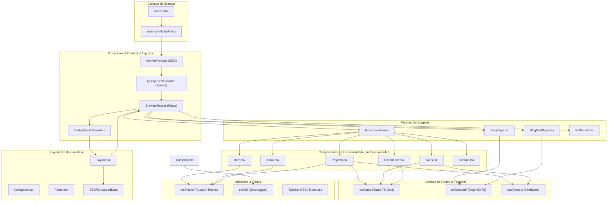

# Projeto Developer Bruno - Arquitetura do Sistema

Este documento descreve a arquitetura técnica do portfólio profissional do Developer Bruno, detalhando a organização dos componentes, fluxo de dados e tecnologias utilizadas.

## Fluxograma da Arquitetura

## Detalhes dos Componentes

### 1. Frontend Core

* **Framework**: React 18.3 com TypeScript.
* **Build Tool**: Vite 7.2 + SWC para compilação ultra-rápida.
* **Estilização**: Tailwind CSS 3.4, seguindo uma estética **Brutalista** (bordas espessas, cores contrastantes, geometria marcada).

### 2. Gerenciamento de Estado e Dados

* **Estado do Servidor**: TanStack Query (React Query) v5 para busca e cache de dados.
* **Dados Estáticos**: Localizados em `src/data/`, exportando arrays tipados de projetos, habilidades e experiências.
* **Conteúdo Dinâmico**: O blog utiliza arquivos em `src/content/`, facilitando a manutenção de artigos via Git.

### 3. SEO e Performance

* **SEO**: Implementação robusta com `react-helmet-async` para meta tags dinâmicas e `JSON-LD` para dados estruturados (Schema.org).
* **Performance**: Monitoramento de Web Vitals adaptado para a realidade brasileira (redes 3G/4G), integrado via hooks customizados.

### 4. UI/UX

* **Primitivos**: Utiliza `shadcn/ui` (baseado em Radix UI) para componentes acessíveis e consistentes.
* **Animações**: Lucide React para ícones e interatividades sutis integradas aos componentes de funcionalidade.
