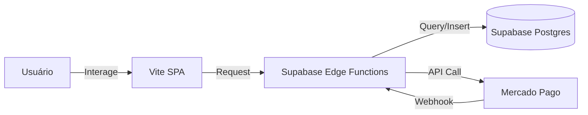

# 🏛️ **Developer Bruno – Architecture Design System**

> **Versão:** 1.0.0
> **Type:** JAMstack / Serverless
> **Core:** Vite + React ↔ Supabase Edge Functions

## 🔭 **1. VISÃO MACRO**

O sistema segue uma arquitetura **Event-Driven Serverless**. Não existe "backend" monolítico.
O frontend (SPA) dispara eventos que são processados por Edge Functions efêmeras.

### **1.1 Principais Decisões**
1.  **Frontend First:** A lógica de apresentação vive 100% no cliente.
2.  **Serverless Compute:** Lógica de negócio (pagamentos, downloads) vive em Deno Functions.
3.  **Database as a Service:** Postgres gerenciado, sem ORM pesado (query builder direto).
4.  **Security at Edge:** Rate limiting e validação ocorrem ANTES de tocar no banco.

***

## 🔄 **2. FLUXO DE DADOS (Data Flow)**

### **2.1 Frontend ↔ Backend**
A comunicação é estritamente via **REST** sobre HTTPS.
- **Origem:** `src/components/antigravity/CheckoutModal.tsx` (Exemplo)
- **Destino:** `https://[project-ref].supabase.co/functions/v1/[function-name]`
- **Segurança:** Headers CORS restritos a domínios permitidos.

### **2.2 State Management**
- **Server State:** Gerenciado via `React Query` (caching, revalidação).
- **UI State:** Gerenciado via `useState` / `Context` (temas, modais).
- **Form State:** `React Hook Form` (isolado do render global).

***

## 🛡️ **3. SEGURANÇA & INTEGRIDADE**

### **3.1 Rate Limiting (Edge Layer)**
Implementado via `_shared/security.ts`.
- **Regra:** Max 5 requests / minuto por IP para endpoints críticos (ex: Pix).
- **Resposta:** 429 Too Many Requests + Header `Retry-After`.

### **3.2 Sanitização**
Todos os inputs passam por sanitização antes de serem processados.
- **Email:** Normalização e remoção de caracteres perigosos.
- **IP:** Extração segura de headers `x-forwarded-for`.

***

## 🚀 **4. DEPLOYMENT & CI/CD**

### **4.1 Frontend**
- **Build:** Vite (`npm run build`).
- **Output:** Static Assets (`dist/`).
- **Host:** Vercel (otimizado para Edge Network).

### **4.2 Functions**
- **Runtime:** Deno.
- **Deploy:** Supabase CLI (`supabase functions deploy`).
- **Env Vars:** Gerenciadas via Vault do projeto (não commitadas).

***

## 📏 **5. DIRETRIZES DE EVOLUÇÃO**

1.  **Novas Features:**
    - Requer persistência? → Crie tabela no Supabase.
    - Requer lógica secreta? → Crie Edge Function.
    - Apenas UI? → Componente React.

2.  **Escalabilidade:**
    - O banco é o gargalo. Use índices.
    - Functions escalam automaticamente.
    - Assets estáticos em CDN (Vercel).
